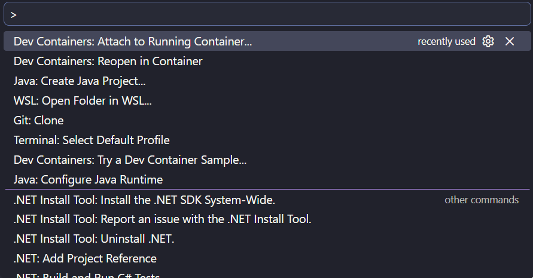
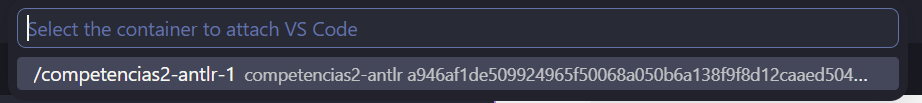
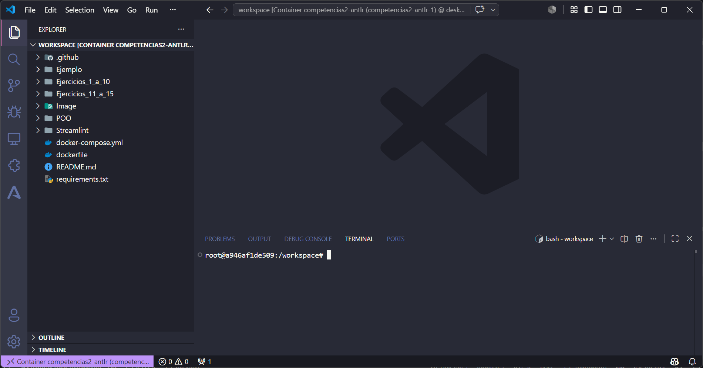

# Analizador Léxico y Semántico ANTLR4 — Compiladores

Analizador léxico y semántico desarrollado con ANTLR4 para la materia de
Lenguajes y Automatas, con variantes de entrada por archivo, por consola y mediante
una interfaz construida con Streamlit. Incluye los ejercicios abarcados a lo
largo de la competencia correspondiente a la materia.

Para el uso de ANTLR se utilizó Docker, facilitando su práctica en distintos
entornos de programación sin depender de una instalación local de Java.

## Tabla de contenido

- [Analizador Léxico y Semántico ANTLR4 — Compiladores](#analizador-léxico-y-semántico-antlr4--compiladores)
  - [Tabla de contenido](#tabla-de-contenido)
  - [Requisitos](#requisitos)
  - [Instalación](#instalación)
  - [Uso](#uso)
    - [Contendor por Terminal](#contendor-por-terminal)
    - [Contenedor por DevContainer](#contenedor-por-devcontainer)
    - [Probar instalación](#probar-instalación)
    - [Variante por archivo](#variante-por-archivo)
    - [Variante por consola](#variante-por-consola)
    - [Interfaz con Streamlit](#interfaz-con-streamlit)
  - [Estructura del proyecto](#estructura-del-proyecto)
  - [Cómo contribuir](#cómo-contribuir)
  - [Licencia](#licencia)
  - [Autores](#autores)

## Requisitos

- Docker
- Visual Studio Code
- Extensión **Dev Containers** de VS Code
- Extensión **ANTLR4 grammar syntax support** de VS Code

ANTLR corre de forma nativa en Java, pero para un uso más práctico se
implementó con Python. Todas las configuraciones necesarias están declaradas
en el `Dockerfile`, junto con la exposición del puerto usado por Streamlit,
declarada en `docker-compose.yml`.

## Instalación

Una vez clonado el repositorio, colócate en la raíz del proyecto y ejecuta
los siguientes comandos en la terminal:

1. Construir el contenedor
   ```bash
   docker compose build
   ```
2. Levantar el contenedor
   ```bash
   docker compose up -d
   ```
3. Verificar el estado del contenedor
   ```bash
   docker ps
   ```

**Salida esperada:**
```
CONTAINER ID   IMAGE                 COMMAND               CREATED      STATUS          PORTS                    NAMES
a946af1de509   nombreContenedor   "tail -f /dev/null"   3 days ago   Up 31 seconds   0.0.0.0:8501->8501/tcp   compete
```

Para detener el contenedor cuando termines:
```bash
docker compose down
```

## Uso

Para el uso del proyecto existen dos formas de acceder al contenedor, la primera es mediante la terminal conectadandose directamente al contenedor. La segunda y la recomendada es mediante *Dev Container*.

### Contendor por Terminal
Una ves ya levantado el contenedor abrir la *terminal* en el proyecto y ejecutar el siguiente comando:
```bash
docker compose exec antlr bash
```
**Salida esperada:**
```
root@a946af1de509:/workspace# 
```
### Contenedor por DevContainer
Para  usar el contenedor con DevContainer siga las siguientes instrucciones:
1. Tener instalada la extencion de VS Code `Dev Container`.
2. Pulsar la combinacion de teclas:
    ```
    Ctrl + Shift + p 
    # O direcatamente en el buscador superior escribir
    >
    ``` 

Esto abrira el buscador superior con las opciones que puede ejecutar VS.
3. Buscar y seleccionar la opcion que diga:
   ```
   Dev Containers: Attach to Running Container
   ```
**Salida esperada:**
   
4. Despues de ejecutarel la instruccion anterior, este mostrara los contenedores que se estan ejecutando, selecione el contenedor correspondiente.
**Salida esperada:**


Al seleccionar el contenedor inmediatamente abrira otra instancia de VS Code, esta instancia esta conectada direcatamente al contenedor por lo que los cambios y los comandos ejecutados se estaran ejecutando direcatamente en el contenedor.

**Resultado esperado:**


### Probar instalación
Colócate dentro de la carpeta `Ejemplo` para probar si la instalación fue
correcta.

Ejecuta ANTLR para reconstruir el **Lexer**:
```bash
antlr4 -Dlanguage=Python3 Expr.g4
```

**Salida esperada:**
```
Expr.interp
Expr.tokens
ExprLexer.interp
ExprLexer.py
ExprLexer.tokens
ExprListener.py
ExprParser.py
```

### Variante por archivo

```bash
python testArchivo.py prueba.txt
```

### Variante por consola

```bash
python testTerminal.py
# Escribe la entrada directamente
```

Ejemplo de entrada:
```
if > x
```

**Salida esperada:**
```
Texto : if
Linea : 1
Columna : 0
Tipo  IF
----------------------
Texto : >
Linea : 1
Columna : 3
Tipo  MAYOR_QUE
----------------------
Texto : x
Linea : 1
Columna : 5
Tipo  ID
----------------------
Texto : <EOF>
Linea : 1
Columna : 7
Tipo  WS
----------------------
```

### Interfaz con Streamlit

Dentro de la carpeta `Ejemplo` ejecutar el comando: 
```bash
streamlit run app.py --server.address=0.0.0.0
```
Con el contenedor levantado y el comando anterior ejecutado, abre en el navegador:
```
http://localhost:8501
```


## Estructura del proyecto

```
├── Ejemplo/
│   ├── .antlr/              # Gramática y reglas léxicas generadas
│   │   ├── Expr.interp
│   │   ├── Expr.tokens
│   │   ├── ExprLexer.interp
│   │   └── ...
│   ├── Expr.g4               # Definición de la gramática
|   ├── analizador_lexico.py  # Analizador  léxico
|   ├── app.py                # Variante para Stremlint
│   ├── archivo.py            # Lectura de Archivos para Stremlit
│   ├── testArchivo.py        # Variante de entrada por archivo
│   ├── testTerminal.py       # Variante de entrada por consola
│   └── prueba.txt            # Archivo de prueba para testArchivo.py
├── Dockerfile
├── docker-compose.yml
└── requirements.txt
```

## Cómo contribuir

1. Crea una rama a partir de `main` siguiendo la convención `tipo/descripcion-corta`
   (ej. `feature/analisis-semantico`, `fix/error-token-numerico`)
2. Sigue [Conventional Commits](https://www.conventionalcommits.org/) para tus mensajes de commit
3. Abre un Pull Request usando la plantilla del repositorio (`.github/PULL_REQUEST_TEMPLATE.md`)
4. Asegúrate de que el checklist del PR esté completo antes de solicitar revisión

## Licencia

Este proyecto está bajo la licencia MIT. Ver el archivo [LICENSE](LICENSE) para más detalles.

## Autores

- Alan Gutiérrez Ortega — [GitHub](https://github.com/AlanGO-god)